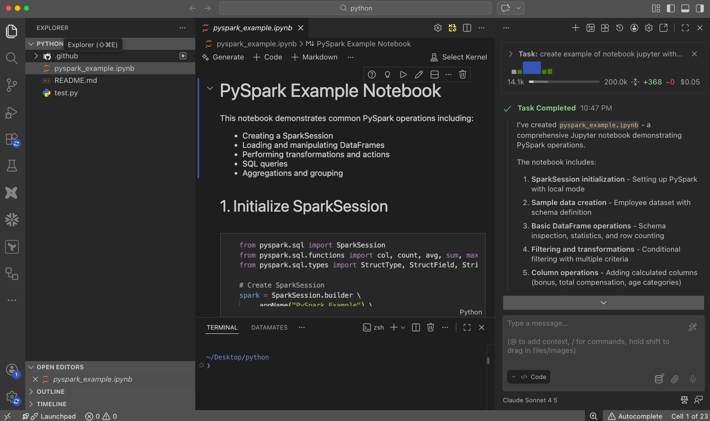

С развитием GenAI появилось множество инструментов, которые могут нам помогать делать нашу работу качественней и быстрей. 

В этом разделе мы рассмотрим различные типы AI-инструментов, которые могут помочь в разработке и решении повседневных задач.

## Чат-боты

- [ChatGPT](https://chatgpt.com/) - самый популярный вариант чат-бота с искусственным интеллектом от OpenAI. Отлично подходит для общих вопросов, объяснения концепций и помощи с кодом. Доступен бесплатный план и платная подписка Plus с доступом к различным версиям GPT-4.

- [Claude.ai](https://claude.ai/) - мощный AI-ассистент от Anthropic, особенно хорошо работает с задачами программирования и анализом кода. Способен обрабатывать большие объемы текста и может помочь с рефакторингом и оптимизацией кода.

- [Gemini](https://gemini.google.com/) - AI-ассистент от Google, который хорошо интегрирован с другими сервисами Google. Может помочь с анализом данных, написанием кода и имеет доступ к актуальной информации из интернета.

- [Perplexity AI](https://www.perplexity.ai/) - интеллектуальная поисковая система с AI, которая всегда указывает источники информации и предоставляет прямые ссылки. Особенно полезна для исследований и проверки фактов.

## Chrome Extensions

- [ChatGPT for Google](https://chrome.google.com/webstore/detail/chatgpt-for-google/jgjaeacdkonaoafenlfkkkmbaopkbilf) - показывает ответы ChatGPT рядом с результатами поиска Google.

- [Sider](https://chromewebstore.google.com/detail/sider-chatgpt-%D0%B1%D0%BE%D0%BA%D0%BE%D0%B2%D0%B0%D1%8F-%D0%BF%D0%B0%D0%BD/difoiogjjojoaoomphldepapgpbgkhkb) - позволяет использовать AI-ассистента на любом сайте для генерации текста, анализа контента, ответов на вопросы, OCR и множества других задач.

- [Codeium](https://chromewebstore.google.com/detail/codeium-ai-code-autocompl/hobjkcpmjhlegmobgonaagepfckjkceh) - расширение для быстрого поиска решений проблем с кодом и объяснений технических концепций прямо в браузере. Может производить автодополнение в таких средах как Jupyter Notebook, Google Colab и других.

## AI-ассистенты для IDE (Copilots)

- [GitHub Copilot](https://github.com/features/copilot) - интегрируется с популярными IDE, предлагает автодополнение кода в реальном времени, помогает писать тесты и документацию. Работает с большинством популярных языков программирования.

- [Codeium](https://codeium.com/) - AI-ассистент для разработчиков, который помогает с поиском решений проблем с кодом и объяснением технических концепций. Интегрируется с популярными IDE и редакторами кода. Компания Codeium провела ребрендинг в Windsurf, но расширение Codeium для IDE продолжает существовать как отдельный продукт.

- [Tabnine](https://www.tabnine.com/) - AI-ассистент для автодополнения кода, который адаптируется под ваш стиль программирования. Поддерживает работу как с облачными, так и локальными моделями.

- [Amazon Q Developer](https://aws.amazon.com/ru/q/developer/) - альтернатива от Amazon, особенно эффективна при работе с AWS. Предлагает подсказки по коду на основе документации AWS и популярных паттернов программирования.

## AI Terminal

- [Warp](https://www.warp.dev/) - AI-powered терминал, который помогает с автодополнением команд и их объяснением. Особенно полезен для работы с git и shell-командами.

## AI IDE

- [Replit](https://replit.com/) - современная облачная IDE со встроенным AI-ассистентом. Включает мощный AI-помощник Replit Agent для написания и отладки кода, поддерживает более 50 языков программирования и предлагает функции мгновенного деплоя. Особенно удобен для обучения и совместной разработки в реальном времени.

- [Cursor](https://cursor.com/) - редактор кода на базе VSCode с продвинутым AI-ассистентом. Позволяет генерировать код из текстового описания, предлагает умное автодополнение и встроенный AI-чат для обсуждения кода. Эффективен для рефакторинга, написания тестов и анализа существующего кода.

- [Windsurf](https://windsurf.com/) - AI IDE (ранее Codeium IDE), прямой конкурент Cursor. Предлагает agentic-подход к разработке с глубокой интеграцией AI в редактор кода.

## AI-агенты для VS Code

Расширения для VS Code, которые превращают редактор в полноценную AI-среду разработки с агентным подходом — они могут автономно читать файлы, вносить правки, запускать команды и работать с терминалом прямо из IDE.

- [Cline](https://github.com/cline/cline) - open-source AI-агент для VS Code, который может автономно создавать и редактировать файлы, запускать команды в терминале и работать с браузером. Поддерживает любые LLM-модели через API (Claude, GPT, Gemini, локальные модели через Ollama). Особенно удобен тем, что показывает каждое действие и запрашивает подтверждение перед выполнением.

- [Kilo Code](https://kilocode.ai/) - форк Cline с дополнительными возможностями. Добавляет несколько режимов работы (Code, Architect, Ask, Debug), улучшенное управление контекстом и поддержку MCP-серверов. Бесплатный и open-source, работает с любыми провайдерами моделей.



## AI Coding Agents (Терминальные агенты)

AI-агенты для программирования — это инструменты, которые работают прямо в терминале и могут автономно выполнять сложные задачи: читать и редактировать файлы, запускать команды, работать с git и управлять целыми проектами.

- [Claude Code](https://claude.ai/code) - AI-агент от Anthropic, работающий прямо в терминале. Может самостоятельно читать файлы, писать код, запускать команды, работать с git и управлять целыми проектами. Поддерживает расширения через [MCP](#mcp--model-context-protocol), Agent Skills, Hooks и Plugins. Включает функцию [Agent Teams](https://code.claude.com/docs/en/agent-teams) — координированная работа нескольких агентов с общим списком задач и обменом сообщениями. Подробнее в нашем курсе [Claude Code 101](/hard-skills/2024-09-02-claude-code-101).

- [Aider](https://aider.chat/) - open-source AI-ассистент для парного программирования в терминале. Поддерживает множество LLM-моделей (GPT-4, Claude, Gemini и др.) и умеет работать с git.

- [GitHub Copilot CLI](https://docs.github.com/en/copilot/using-github-copilot/using-github-copilot-in-the-command-line) - AI-ассистент от GitHub для командной строки, помогает с генерацией shell-команд и объяснением ошибок.

## Оркестрация AI-агентов

Инструменты для запуска и координации нескольких AI-агентов одновременно — от простых параллельных сессий до промышленных фабрик с десятками агентов.

- [Gas Town](https://github.com/steveyegge/gastown) - промышленная фабрика агентов от Стива Йегге (ex-Amazon, ex-Google). Запускает 20-30 агентов с ролями: Мэр (координатор), Рабочие (исполнители), Завод (мерж изменений), Наблюдатель (следит за застрявшими). Для опытных пользователей.

- [Claude MPM](https://github.com/bobmatnyc/claude-mpm) - мульти-агентный проект-менеджер с 47+ специализированными ролями и 44+ встроенными навыками. Готовые агенты: архитектор, разработчик, тестировщик, ревьюер.

- [cmux](https://github.com/manaflow-ai/cmux) - запускает Claude Code, Codex CLI, Gemini CLI и другие агенты параллельно, каждый в своём изолированном VS Code workspace. Полная изоляция без конфликтов.

- [OpenSpec](https://openspec.dev/) - фреймворк, где спецификация первична, а код — следствие. Работает с Claude Code, Cursor, Windsurf, Copilot. Генерирует `CLAUDE.md` и `.claude/commands/` для Claude Code.

| Инструмент | Сложность | Масштаб | Особенность |
| ---------- | --------- | ------- | ----------- |
| Agent Teams (встроен в Claude Code) | Средняя | 3-5 агентов | Общение между агентами, общий список задач |
| Gas Town | Очень высокая | 20-30 агентов | Промышленная фабрика с ролями и workflows |
| Claude MPM | Средняя | 5-15 агентов | 47+ готовых ролей |
| cmux | Низкая | 3-5 агентов | Изолированные VS Code workspaces |
| OpenSpec | Низкая | Любой | Спецификация как единый источник правды |

Подробнее — в курсе [Claude Code 101, Модуль 7](/hard-skills/2024-09-02-claude-code-101#модуль-7-армия-агентов--автономная-разработка).

## MCP — Model Context Protocol

[MCP](https://modelcontextprotocol.io/) — открытый стандарт для подключения AI-агентов к внешним инструментам. Позволяет Claude Code, Cline, Kilo Code и другим агентам работать с базами данных, трекерами задач, мониторингом и сотнями других сервисов.

**Популярные MCP-серверы:**

| Сервер | Что делает |
| ------ | ---------- |
| [GitHub](https://api.githubcopilot.com/mcp/) | PR, issues, ревью кода |
| [Sentry](https://mcp.sentry.dev/mcp) | Мониторинг ошибок в продакшене |
| [PostgreSQL](https://github.com/bytebase/dbhub) | Запросы к базе данных |
| [Notion](https://mcp.notion.com/mcp) | Документация и wiki |
| [Slack](https://mcp.slack.com/mcp) | Сообщения и каналы |

Полный список: [github.com/modelcontextprotocol/servers](https://github.com/modelcontextprotocol/servers)

Подробнее — в курсе [Claude Code 101, Модуль 8](/hard-skills/2024-09-02-claude-code-101#модуль-8-mcp-и-agent-skills--расширяем-возможности-claude-code).

## Шлюзы и прокси к AI-моделям

Инструменты для подключения AI-агентов к разным моделям: бесплатным, локальным или через корпоративных провайдеров.

### OpenRouter — универсальный шлюз

[OpenRouter](https://openrouter.ai/) — единый API с доступом к 400+ моделям от 60+ провайдеров. Один ключ, сотни моделей, включая бесплатные.

```bash
# Для Claude Code
export ANTHROPIC_BASE_URL="https://openrouter.ai/api/v1"
export ANTHROPIC_AUTH_TOKEN="or_ваш_ключ"
claude --model openai/gpt-oss-20b
```

Для VS Code расширений (Cline, Kilo Code) — выберите OpenRouter как провайдер в настройках и укажите API-ключ.

**Популярные бесплатные модели:**

| Модель | Описание | Контекст |
| ------ | -------- | -------- |
| `deepseek/deepseek-r1:free` | Сильные рассуждения | 128K |
| `qwen/qwen3-coder:free` | Оптимизирована для кода | 262K |
| `openai/gpt-oss-20b:free` | Open-weight от OpenAI | 128K |

### Claude Code Router — умный прокси

[Claude Code Router](https://github.com/musistudio/claude-code-router) — прокси с умной маршрутизацией: разные задачи автоматически отправляются на разные модели. «Отформатируй JSON» идёт на бесплатную модель, а «спроектируй архитектуру» — на Claude.

```bash
npm install -g @musistudio/claude-code-router
ccr start
```

### Ollama — модели на своём компьютере

[Ollama](https://ollama.com/) — запуск моделей локально. Код никуда не уходит — всё на вашей машине.

```bash
brew install ollama
ollama pull qwen3:4b

export ANTHROPIC_BASE_URL="http://localhost:11434/v1"
export ANTHROPIC_AUTH_TOKEN="ollama"
claude --model qwen3:4b
```

Когда полезно: приватный код, работа без интернета, нет лимитов на токены.

### LiteLLM — прокси для смешанных конфигураций

[LiteLLM](https://docs.litellm.ai/) — единая точка входа для нескольких провайдеров с логированием затрат и балансировкой нагрузки.

### Официальные облачные провайдеры

Для корпоративных сценариев — те же модели Claude, но оплата через вашего облачного провайдера:

- **Amazon Bedrock** — `export CLAUDE_CODE_USE_BEDROCK=1`
- **Google Vertex AI** — `export CLAUDE_CODE_USE_VERTEX=1`
- **Microsoft Azure Foundry** — `export CLAUDE_CODE_USE_FOUNDRY=1`

### Сравнение подходов

| Подход | Сложность | Стоимость | Приватность | Качество |
| ------ | --------- | --------- | ----------- | -------- |
| OpenRouter | Простой | От $0 | Средняя | Зависит от модели |
| Claude Code Router | Средний | От $0 | Средняя | Умная маршрутизация |
| Ollama | Средний | $0 | Максимальная | Ограничено размером модели |
| LiteLLM | Сложный | Зависит | Средняя | Гибкий |
| Bedrock/Vertex/Foundry | Средний | Pay-as-you-go | Высокая | Claude (полное качество) |

Подробнее — в курсе [Claude Code 101, Модуль 10](/hard-skills/2024-09-02-claude-code-101#модуль-10-claude-code-с-другими-моделями).

## Claude Code 101 — курс

Мы подготовили полный курс по Claude Code на русском языке — **10 модулей** от основ LLM до продвинутых техник работы с армией агентов:

- Основы LLM и как работают большие языковые модели
- Установка, настройка и возможности Claude Code
- Практика: анализ акций с помощью Claude Code
- Качество кода от AI, MCP, Agent Skills, лучшие практики
- Армия агентов: Agent Teams, оркестрация, git worktrees
- Работа с другими моделями (OpenRouter, Ollama, LiteLLM)

[Перейти к курсу Claude Code 101 →](/hard-skills/2024-09-02-claude-code-101)
